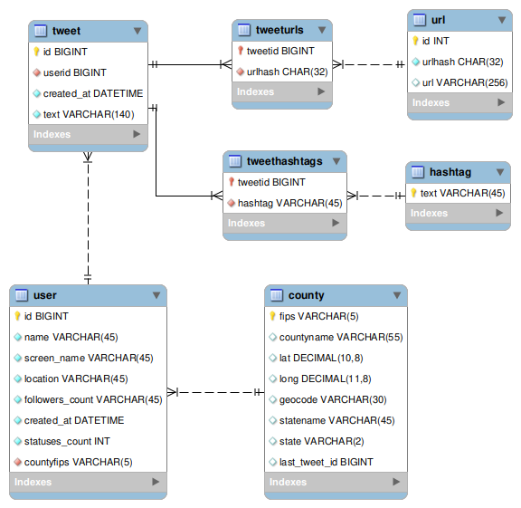

# localtwitter
Set of scripts to help gather twitter data from users who are able to be located by the geocode search parameter provided by the twitter API.

To make any of this work, you'll need to create a `.env` file in the root project directory that contains the following fields:
```
T_CONSUME_KEY="<YOUR-TWITTER-CONSUME-KEY>"
T_CONSUME_SECRET="<YOUR-TWITTER-CONSUME-SECRET>"
T_ACCESS_KEY="<YOUR-APP-ACCESS-KEY>"
T_ACCESS_SECRET="<YOUR-APP-ACCESS-SECRET>"
DB_USER="<YOUR-DB-USER>"
DB_PASSWORD="<YOUR-DB-PW>"
DB_HOST="<YOUR-DB-HOST>"
DB_DATABASE="<YOUR-DB-DATABASE-NAME>"
```


The numbered scripts are a roughly time-ordered list of experiments/examples of how how to start up a full time gather, and a draft of how you'd extract named entities from the existing tweets. 

The db methods will help create the following mysql schema:




## TODO

* Wrap this in a CLI app
	- Manage creating a new database, starting searches
* Update Readme.