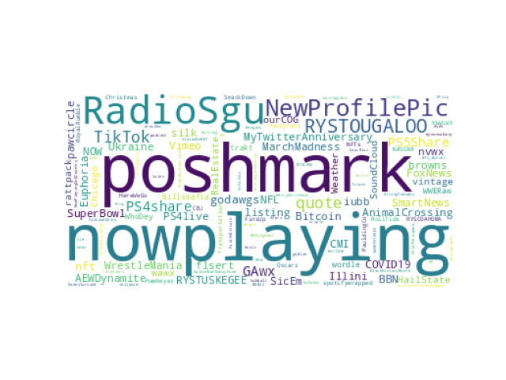
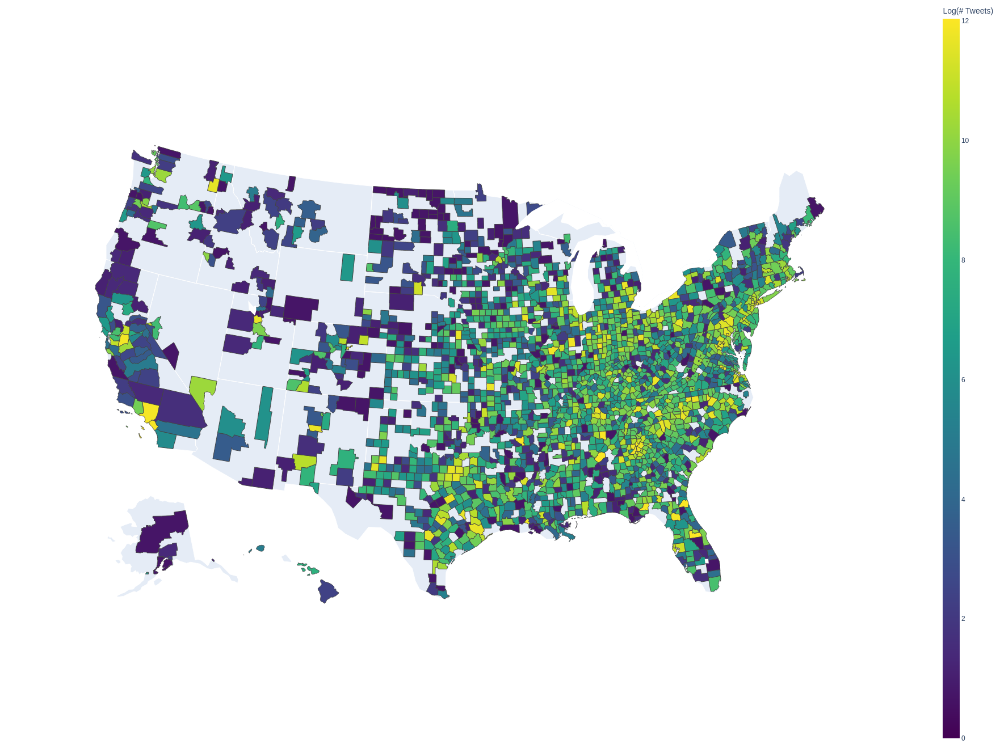

# localtwitter
Set of scripts to help gather twitter data from users who are able to be located by the geocode search parameter provided by the twitter API.


## Requirements
To make any of this work, you'll need to create a `.env` file in the root project directory that contains the following fields:
```
T_CONSUME_KEY="<YOUR-TWITTER-CONSUME-KEY>"
T_CONSUME_SECRET="<YOUR-TWITTER-CONSUME-SECRET>"
T_ACCESS_KEY="<YOUR-APP-ACCESS-KEY>"
T_ACCESS_SECRET="<YOUR-APP-ACCESS-SECRET>"
DB_USER="<YOUR-DB-USER>"
DB_PASSWORD="<YOUR-DB-PW>"
DB_HOST="<YOUR-DB-HOST>"
DB_DATABASE="<YOUR-DB-DATABASE-NAME>"
```

The numbered scripts are a roughly time-ordered list of experiments/examples of how how to start up a full time gather, and a draft of how you'd extract named entities from the existing tweets. They also show how some of the analysis is done, and outputs are generated. 

The full gather script is in the 10th example script, [here](10_long_running_gather.py).

## Database Setup
The db methods will help create the following mysql schema:


## Analysis Examples

### Hashtag Wordclouds
Outputs from the 14th script; [14_test_vis_wordclouds](14_test_vis_wordclouds.py)


### Choropleths
Output from the 16th script; (16_test_choropleth)(16_test_choropleth.py)


