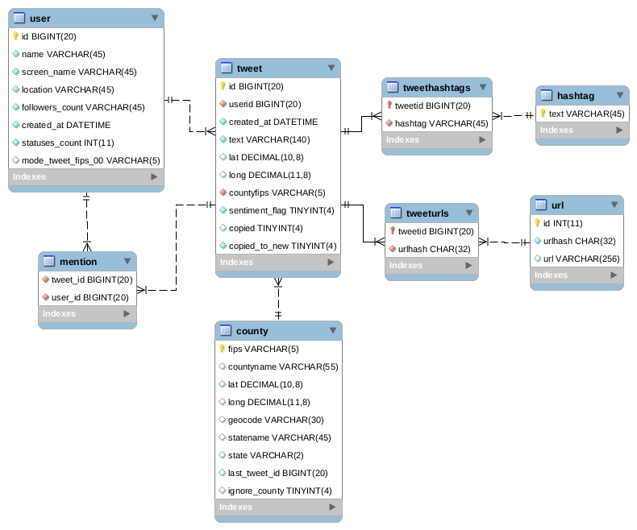

# localtwitter
Right now, this shows how to mine 'localized' users, by searching for tweets within a specific distance of a lat/long pair. This is possible because of the geocode parameter exposed in the twitter search api. The scripts here will help create a db, and then fill it with tweet data. 

To make any of this work, you'll need to create a `.env` file in the root project directory that contains the following fields:
```
T_CONSUME_KEY="<YOUR-TWITTER-CONSUME-KEY>"
T_CONSUME_SECRET="<YOUR-TWITTER-CONSUME-SECRET>"
T_ACCESS_KEY="<YOUR-APP-ACCESS-KEY>"
T_ACCESS_SECRET="<YOUR-APP-ACCESS-SECRET>"
DB_USER="<YOUR-DB-USER>"
DB_PASSWORD="<YOUR-DB-PW>"
DB_HOST="<YOUR-DB-HOST>"
DB_DATABASE="<YOUR-DB-DATABASE-NAME>"
```

The db methods will help create the following mysql schema:




## TODO

* Wrap this in a CLI app
	- Manage creating a new database, starting searches
* Update Readme.